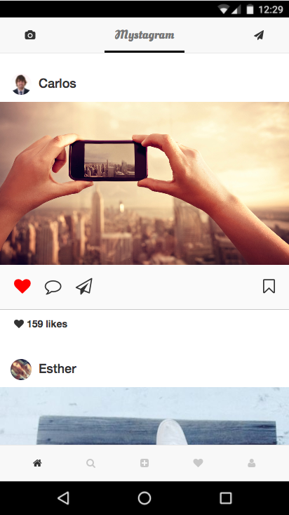

# Instagram Clone Tutorial
This repository includes the code for a web development introduction
course. This is an introductory course for interns at HomeAway.

<p align="center">
  
</p>

## Tutorial Index
1. [Chapter 1: Mystagram](./tutorial/CHAPTER1.md)
1. [Chapter 2: Playground](./tutorial/CHAPTER2.md)

## Run the development environment
```
npm run start
```

## Deploy to GitHub Pages
1. Fork repository.
2. Change `homepage` in `package.json` for https://YOURUSERNAME.github.io/mystagram/
3. Run `npm run deploy`
4. Navigate to https://YOURUSERNAME.github.io/mystagram/

## Create React App
[Here you can see the documentation for Create React App](./CREATE_REACT_APP.md)
